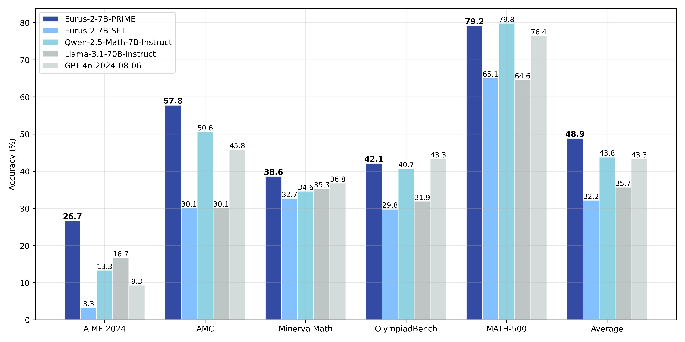
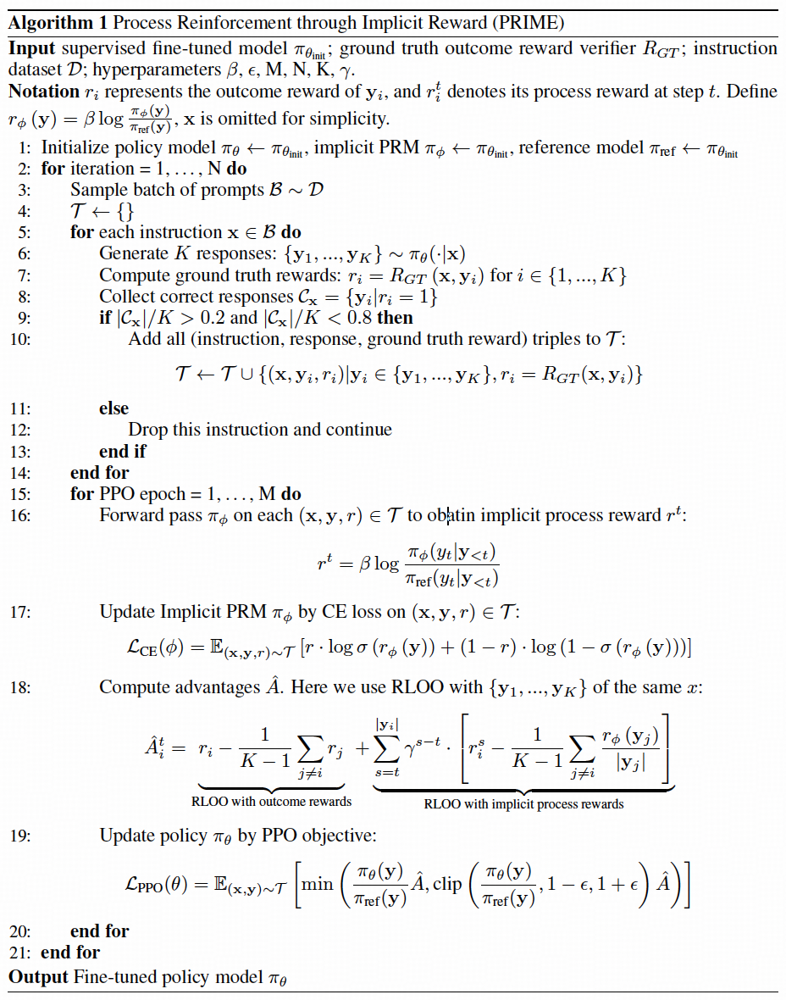

# Eurus-2-7B-PRIME

## Links

- 📜 [Paper](https://arxiv.org/abs/2502.01456)
- 📜 [Blog](https://curvy-check-498.notion.site/Process-Reinforcement-through-Implicit-Rewards-15f4fcb9c42180f1b498cc9b2eaf896f)
- 🤗 [PRIME Collection](https://huggingface.co/PRIME-RL)
- 🤗 [RL Data](https://huggingface.co/datasets/PRIME-RL/Eurus-2-RL-Data)

## Introduction



Eurus-2-7B-PRIME is trained using **PRIME** (**P**rocess **R**einforcement through **IM**plicit r**E**ward) method, an open-source solution for online reinforcement learning (RL) with process rewards, to advance reasoning abilities of language models beyond imitation or distillation. It starts with [Eurus-2-7B-SFT](https://huggingface.co/PRIME-RL/Eurus-2-7B-SFT) and trains on [Eurus-2-RL-Data](https://huggingface.co/datasets/PRIME-RL/Eurus-2-RL-Data).


As shown in the animation above, in PRIME, the policy model and PRM are both initialized with the SFT model. For each RL iteration, the policy model first generates rollouts. Then, the [implicit PRM](https://arxiv.org/abs/2412.01981) and outcome verifier score the rollouts, and the implicit PRM gets updated on the rollouts with the outcome reward. Finally, the outcome reward \\(r_o\\) and process reward \\(r_p\\) are combined and used to update the policy model. 

The PRIME implementation pseudocode is as follows:



The algorithm flow includes:

1. **Prompt filtering** based on policy model performance, only preserving those on which the policy model \\(\pi_\theta\\) achieves a accuracy between 0.2 and 0.8.
2. **Calculate implicit process reward** \\(r^t\\).
3. **Update Implicit PRM** \\(\pi_\psi\\) based on predicted implicit process reward \\(r^t\\) and ground truth outcome label \\(r\\).
4. **Advantage estimation with RLOO.** Specifically, we first calculate the return of outcome rewards and implicit process rewards separately:

- For ground truth outcome rewards, we directly adopt RLOO without any modification.

- For implicit process rewards, we perform a three-step process to calculate return: (1) Use the averaged implicit process rewards to calculate the leave-one-out baseline (2) Normalize the process reward at step \\(t\\) by subtracting the baseline; (3) Calculate the discounted return for each response.

  Finally, advantage is set to the combination of both returns. 

​    5. **Update the policy** \\(\pi_\theta\\) using PPO loss for legit importance sampling.

## Usage

We apply tailored prompts for coding and math task:


**Coding**

```
{question} + "\n\nWrite Python code to solve the problem. Present the code in \n```python\nYour code\n```\nat the end."
```

**Math**

```
{question} + "\n\nPresent the answer in LaTex format: \\boxed{Your answer}"
```


```python
import os
from tqdm import tqdm
import torch
from transformers import AutoTokenizer
from vllm import LLM, SamplingParams
os.environ["NCCL_IGNORE_DISABLED_P2P"] = "1"
os.environ["TOKENIZERS_PARALLELISM"] = "true"

def generate(question_list,model_path):
    llm = LLM(
        model=model_path,
        trust_remote_code=True,
        tensor_parallel_size=torch.cuda.device_count(),
        gpu_memory_utilization=0.90,
    )
    sampling_params = SamplingParams(max_tokens=8192,
                                    temperature=0.0,
                                    n=1)
    outputs = llm.generate(question_list, sampling_params, use_tqdm=True)
    completions = [[output.text for output in output_item.outputs] for output_item in outputs]
    return completions

def make_conv_hf(question, tokenizer):
    # for math problem
    content = question + "\n\nPresent the answer in LaTex format: \\boxed{Your answer}"
    # for code problem
    # content = question + "\n\nWrite Python code to solve the problem. Present the code in \n```python\nYour code\n```\nat the end." 
    msg = [
        {"role": "user", "content": content}
    ]
    chat = tokenizer.apply_chat_template(msg, tokenize=False, add_generation_prompt=True)
    return chat
    
def run():
    model_path = "PRIME-RL/Eurus-2-7B-PRIME"
    all_problems = [
        "which number is larger? 9.11 or 9.9?"
    ]
    tokenizer = AutoTokenizer.from_pretrained(model_path)
    completions = generate([make_conv_hf(problem_data, tokenizer) for problem_data in all_problems],model_path)
    print(completions)
    # [['[ASSESS]\n\n# The problem asks us to compare two decimal numbers, 9.11 and 9.9, to determine which one is larger.\n# We need to compare the whole parts and the decimal parts of the numbers.\n\nNext action: [ADVANCE]\n\n# Compare the whole parts of the numbers: both 9.11 and 9.9 have the same whole part, which is 9.\n# Compare the decimal parts of the numbers: 0.11 (from 9.11) is less than 0.9 (from 9.9).\n\nNext action: [ADVANCE]\n\n# Since the whole parts are the same and the decimal part of 9.9 is greater than the decimal part of 9.11, we can conclude that 9.9 is larger than 9.11.\n\nNext action: [OUTPUT]\n\nThe final answer is $\\boxed{9.9}$.\n\n']]
if __name__ == "__main__":
    run()
```


## Evaluation

Through PRIME, we successfully achieve substantial improvements on key reasoning benchmarks over our SFT version of the model, leading to **16.7%** improvement on average, and over **20%** on AMC&AIME competitions. Our final model Eurus-2-7B-PRIME, based on Qwen-2.5-Math-7B-Base, surpassed its instruct version on 5 key reasoning benchmarks. 

The final results are presented below:

|               | **Eurus-2-7B-PRIME** | **Eurus-2-7B-SFT** | **Qwen-2.5-Math-7B-Instruct** | **Llama-3.1-70B-Instruct** | **GPT-4o** |
| ------------- | -------------------- | ------------------ | ----------------------------- | -------------------------- | ---------- |
| AIME 2024     | **26.7 (+23.3)**     | 3.3                | 13.3                          | 16.7                       | 9.3        |
| MATH-500      | 79.2 (+14.1)         | 65.1               | **79.8**                      | 64.6                       | 76.4       |
| AMC           | **57.8 (+27.7)**     | 30.1               | 50.6                          | 30.1                       | 45.8       |
| Minerva Math  | **38.6 (+5.9)**      | 32.7               | 34.6                          | 35.3                       | 36.8       |
| OlympiadBench | 42.1 (+12.3)         | 29.8               | 40.7                          | 31.9                       | **43.3**   |
| Avg.          | **48.9 (+ 16.7)**    | 32.2               | 43.8                          | 36.4                       | 43.3       |


We achieved this with only 1/10 data and model resources compared with Qwen-Math.

|            | **Eurus-2-7B-PRIME**               | **Qwen2.5-Math-7B-Instruct**    |
| ---------- | ---------------------------------- | ------------------------------- |
| Base Model | Qwen2.5-Math-7B                    | Qwen2.5-Math-7B                 |
| SFT Data   | **230K (open-source)**             | 2.5M (open-source and in-house) |
| RM Data    | **0**                              | 618K (in-house)                 |
| RM         | **Eurus-2-7B-SFT**                 | Qwen2.5-Math-RM (72B)           |
| RL Data    | **150K queries  \\(\times\\)4 samples** | 66K queries \\(\times\\) 32 samples |


## Citation

```latex
@article{cui2025process,
  title={Process reinforcement through implicit rewards},
  author={Cui, Ganqu and Yuan, Lifan and Wang, Zefan and Wang, Hanbin and Li, Wendi and He, Bingxiang and Fan, Yuchen and Yu, Tianyu and Xu, Qixin and Chen, Weize and others},
  journal={arXiv preprint arXiv:2502.01456},
  year={2025}
}
```

```latex
@article{yuan2024implicitprm,
  title={Free Process Rewards without Process Labels},
  author={Lifan Yuan and Wendi Li and Huayu Chen and Ganqu Cui and Ning Ding and Kaiyan Zhang and Bowen Zhou and Zhiyuan Liu and Hao Peng},
  journal={arXiv preprint arXiv:2412.01981},
  year={2024}
}
```